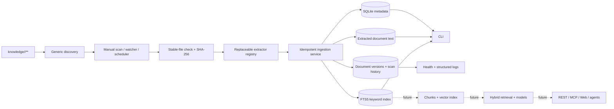

# AI File Manager Architecture

This diagram distinguishes implemented components from future milestones. The core remains domain-agnostic: every first-level directory under `knowledge/` automatically becomes a domain.

## Milestone 2 component boundaries

- Files remain authoritative and are never modified.
- Discovery derives domains only from folders; there is no domain registry.
- Extractors are replaceable and isolated from orchestration.
- A checksum identifies document content; unchanged content is not re-extracted.
- Each successfully observed checksum is retained as an immutable version.
- Extraction attempts and scan summaries provide an operational audit trail.
- Files that change during processing are deferred until a later scan.
- FTS5 is rebuildable from stored document text.

